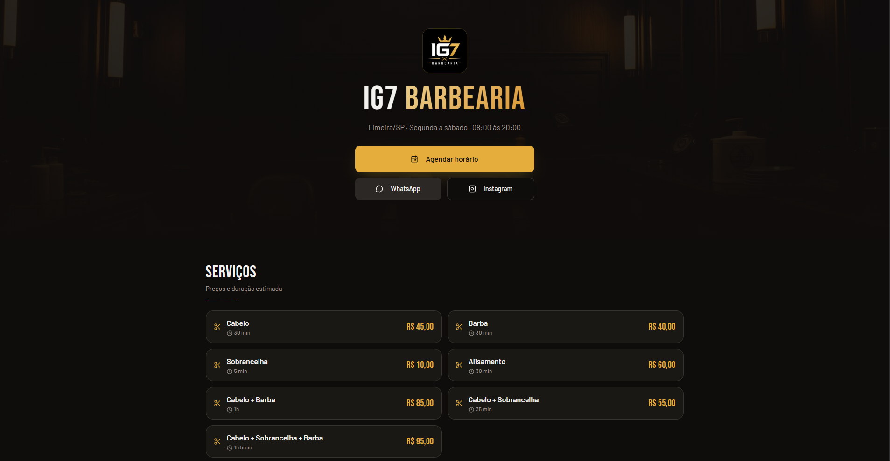
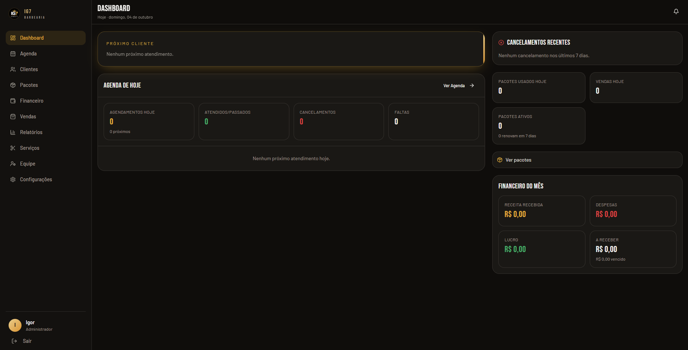
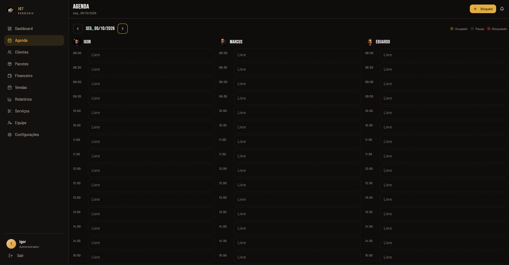
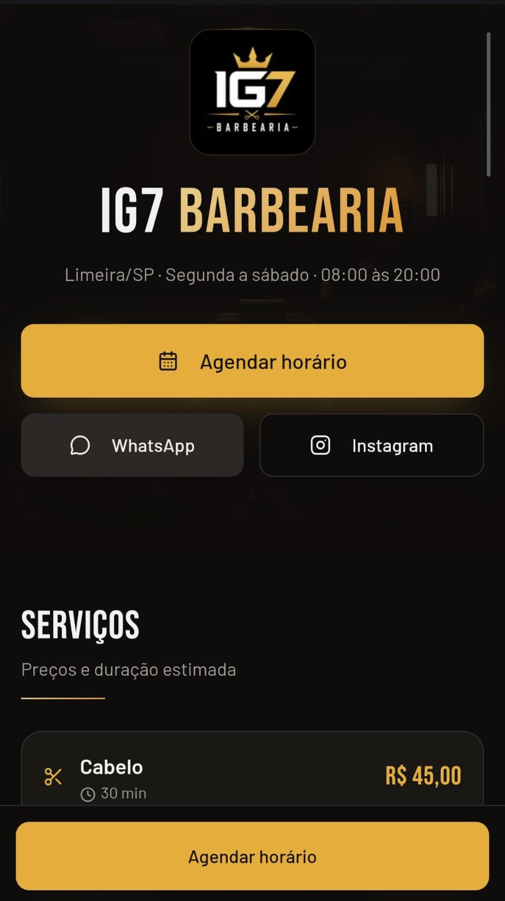
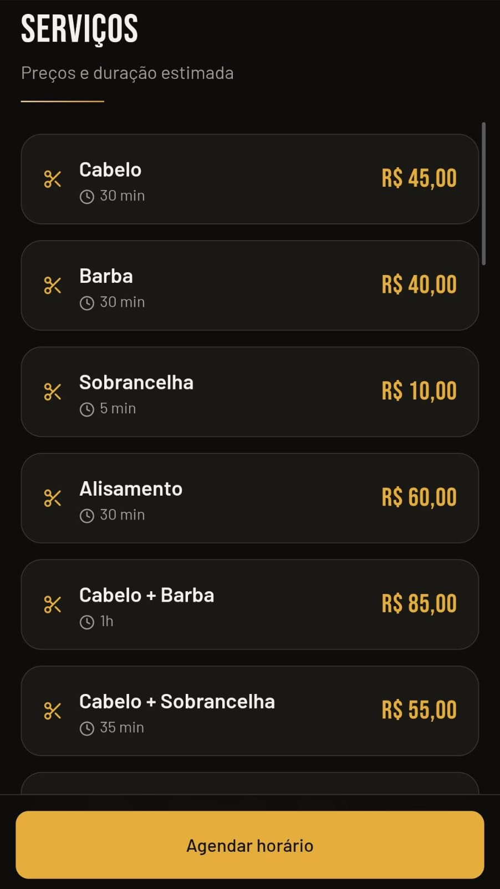
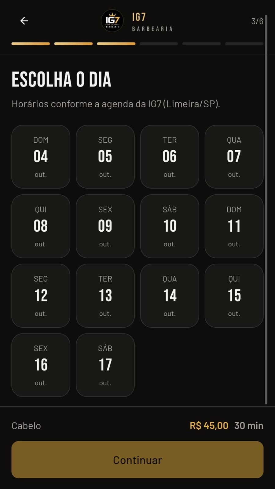
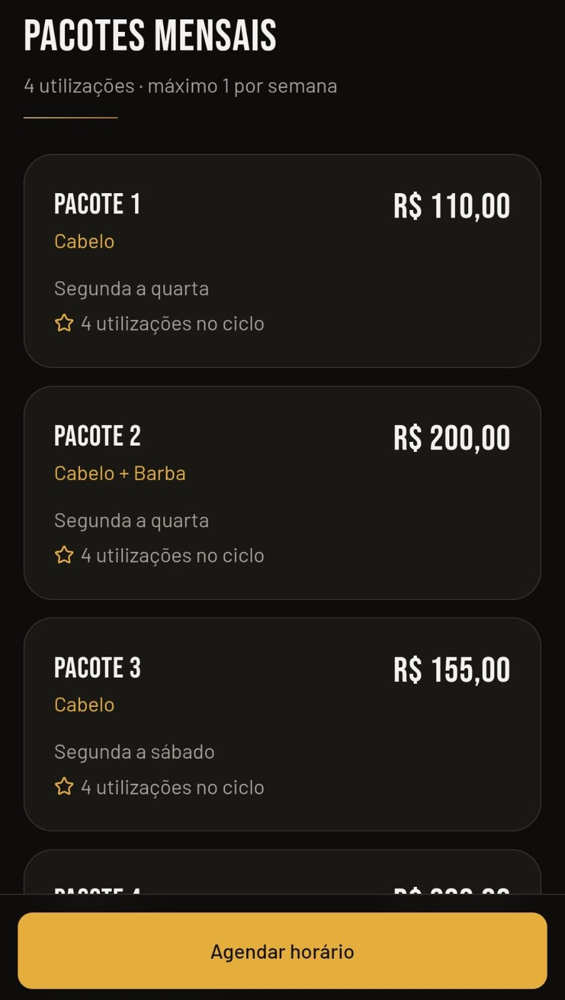

# IG7 Barbearia — Portfolio

Sistema web de gestão e agendamento desenvolvido para uma barbearia real.

> Este repositório é uma **versão pública e sanitizada para portfólio**. Os dados usados aqui são fictícios e a infraestrutura de produção, credenciais, banco e regras privadas permanecem em repositório privado.

## Destaques

- Agendamento público mobile-first
- Agenda individual por barbeiro
- Gestão de clientes e histórico
- Pacotes com ciclos semanais
- Financeiro, despesas e contas a receber
- Produtos, estoque e vendas
- Dashboard e relatórios
- Equipe com permissões
- Pix com QR Code e confirmação manual
- PWA / Web Push
- Integração com calendário

## Tecnologias

React • TypeScript • Supabase/PostgreSQL • RLS • PWA • Git/GitHub

## Rodando a demo

```bash
git clone https://github.com/Felip3Anjos/ig7-barbearia-portfolio.git
cd ig7-barbearia-portfolio
npm install
npm run dev
```

## Segurança

A aplicação real valida permissões no backend/banco, usa RLS, tokens seguros para cancelamento, proteção contra pagamentos duplicados e armazenamento privado.

## Observação

Nenhum dado real de cliente, senha, chave privada, token administrativo ou credencial de produção é incluído neste repositório.

## Screenshots

### Página pública



### Sistema administrativo





### Experiência mobile

<p align="center">
  
  
  
</p>

### Pacotes

<p align="center">
  
</p>
